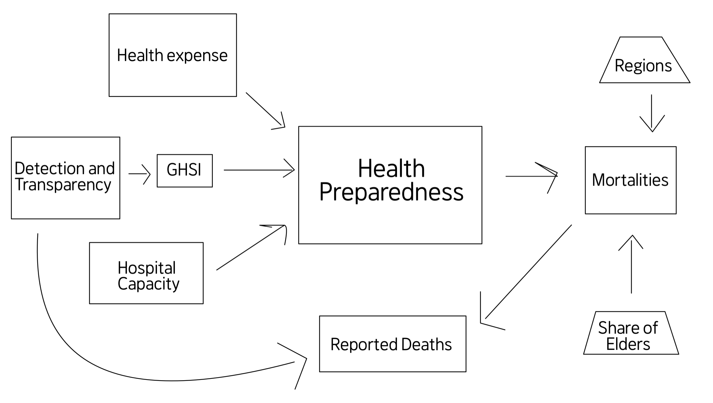

```{r setup, include=FALSE}
# NOTE: these setup chunks should go at the top of the article

knitr::opts_chunk$set(echo = TRUE) 

library(tidyverse)
library(ggplot2)
library(magrittr)
library(dplyr)
library(readr)
library(countrycode)
library(ggthemes)
library(wordcountaddin) # This library to count words of this report

# Load the csv file from the given source

data <- read.csv("https://wzb-ipi.github.io/corona/df_full.csv") %>%
          filter(elapsed == 334)

# Select columns that are desired
data <- data %>%
  select(country, continent, population_2019, pop_density, deaths_cum, deaths_cum_per_million, health_exp_pc, hosp_beds_pc, share_older, detect_index)

# Bring the GHS Index
# Directly brought from the GHS Index website

ghsi <- read.csv('ghsi.csv')
data <- left_join(data, ghsi)

```

Word Count: 3128

## Abstract

Can we say that countries with better health preparedness perform better in controlling the spread of COVID-19? Generally people might think this is plausible. However, the United States, with the highest Global Health Security (GHS) Index[^GHSI], has reported a staggering number of cases--over 15 million--and over 300 thousand deaths from COVID-19, which is by far the most of any country, as of December 12, 2020. Moreover, other wealthy countries do not seem to perform well, either. In this report, we attempt to explain this counter-intuitive pattern.


## Introduction

Since the first reported case in December 2019, and the declaration of pandemic in March 2020 by WHO, COVID-19 has affected more than 170 countries and infected at least 70 million people with more than 1.6 million dead as of December 12, 2020. Moreover, COVID-19 has brought unprecedented challenges to a variety of economic activities, affecting more than half of the world population as a result of lockdown policy (Singh and Bandewar et al., 2020).[^Singh]
  	
Furthermore, governments of various countries encountered challenges identifying infections due to the presence of asymptomatic cases. Also, the novel coronavirus has displayed a unique development of symptoms that has never been present in the previous epidemics such as SARS and MERS. 
	
Governments have seen the burst of spread of COVID-19, and they are aware of the fact that the massive volume of infections overloads the healthcare system, which is essential for better recovery for patients. Phougeishangbam and Mayanglambam describe the effect of such burden on healthcare workers: exhaustion and sleepless daily pattern, insufficient protection from the virus, exposure to violence, etc. (2020).[^Phougei] Also, the explosive increase in cases easily overwhelms the capacity of each hospital for admission. This, unfortunately, leads to lethal cases that are preventive.
	
This research paper examines whether or not healthcare welfare and preparedness could affect the number of death cases. Generally, there is an intuition that a better healthcare system would lead to less mortality rates. However, some of the sources have claimed that healthcare quality does not necessarily correlate with coronavirus-associated deaths (Bosancianu and Dionne et al, 2020).[^Bosancianu] Furthermore, the Global Health Security Index (GHSI) could not anticipate actual preparedness regarding the novel coronavirus (Abbey and Khalifa, 2020).[^Abbey] With these claims in mind, this paper attempts to answer the following research questions: does the quality of healthcare system reduce the mortality rate from COVID-19, and if so, how?


## Keywords and Their Definitions

COVID-19: The pandemic of coronavirus declared by the World Health Organization in March 2020.

Mortality: The *reported* deaths per million.

Healthcare preparedness: The quality of healthcare systems that are measured by various factors such as the GHSI, healthcare expenditures, and the availability of hospital beds. 

GHSI: Global Health Security Index. A “comprehensive assessment of global health security capabilities in 195 countries” available on https://www.ghsindex.org/. 

Healthcare expenditure: The amount of national budget spent on healthcare systems. 

Availability of hospital beds: Number of hospital beds per capita. 

## Literature review

Some of the research on COVID-19 has incorporated factors related to healthcare systems. For instance, the impact of social distancing on healthcare demand has been studied, which concludes that social distancing is deemed to be crucial in ensuring that “COVID-19 cases do not exceed local hospital capacity” (Wang et al, 2020).[^Wang] This particular research acknowledged the fact that hospital capacity is an important factor that could help to manage the impact of the pandemic, which provided further motivation for studying the potential association between healthcare quality and COVID-19 mortality rates.

<!-- Note: correlation is a specific statistic. Association refers to any kind of relationship between two variables and is the better word unless you are referring specifically to correlation. -->

Blass and Penny note that COVID-19 is different then other natural disasters we have faced (2020).[^Blass] They criticize that health service providers were not prepared for the novel coronavirus, unlike previous epidemics. With the rise of online services, cybersecurity and protocols for distanced conferences and meetings have become vital.[^Blass] Their article adds that staff members have difficulty working remotely because they never had this experience before. They conclude that the characteristics of COVID-19 have changed adequate guidelines for possible future disasters, and the providers must prepare such procedures.

Consider the case of Vietnam, whose control of the pandemic has been widely praised. Even though Vietnam lies on the lower end of both healthcare expenditure and hospital beds per capita, they have less than 50 deaths after two major waves of COVID-19. As of now, life in Vietnam is mostly back to normal, with the exception of a halt in tourism across the country.

97 percent of Vietnamese approve of their government’s directives during the pandemic, showing that most policies enacted by the government are met with positive reception.[^Walden] There are other factors that are hard to quantify and put into raw numbers, though.

Furthermore, before and during the first wave, all education institutions were shut down to reduce the spread of the virus.[^Tran] Primarily grocery stores and supermarkets were allowed to open, while all other non-essential business (entertainment, dine-in, etc.) were shut down. So-called bed-field hospitals, very rudimentary but serviceable, were rapidly established in hotspots like Da Nang.[^Huynh] 

## Methodology

We chose three variables, the GHSI, healthcare expenditure, and the number of hospital beds, to measure the healthcare quality. We will look at the relationship between them and the dependent variable, COVID-19 associated deaths per million. Note that the data are the official reported statistics from each country, and they do not reflect the actual, live-time counts. The data have been collected from this project: https://wzb-ipi.github.io/corona/. Control variables like population share of elders, and regions will be considered as well in order to discuss unexpected results.

We plotted the independent variables on the x-axis and the dependent variable on the y-axis, and we used linear regression to show the association. Then we added the confounding variables as colors, when needed, in order to display how they might contribute to the expected (or unexpected) results. 

In our model, the healthcare preparedness (to the pandemic) is based on the GHSI, healthcare expenditures, the number of beds, and the detection and reliability. The figure below shows the causal graph.

<!-- Note: Love the DAG! :) -->



### Hypothesis

> We expect that better healthcare preparedness reduces mortality, due to the adequate control of the spread by policies and detection, better healthcare services, and larger capacities of hospitals.

## Results

### Health Expenditure

```{r plot-health-expenses}

# Plot data to show correlation between health expenses and COVID-19 deaths per million

ggplot(data, aes(y=deaths_cum_per_million, x=health_exp_pc)) +
    theme_tufte() +
    stat_smooth(method='lm') +
    geom_point() +
    labs(title = "Health Expenses and COVID-19-associated deaths per million",
         subtitle = "All Countries", y = "Deaths per million", x = "Health Expenses per capita (USD)") 

```

```{r health-expenses}
 # Get correlation
cor(data$health_exp_pc, data$deaths_cum_per_million, use = "complete.obs")
 

 # Linear Regression
lm_health_exp <- lm(deaths_cum_per_million ~ health_exp_pc, data)
summary(lm_health_exp)

t.test(data$health_exp_pc, data$deaths_cum_per_million)
```

This rather looks very unexpected, indincating more deaths for more health expenses per capita. The graph above displays a slightly positive correlation between health expenses per capita and deaths per million with the correlation coefficient of 0.405. Linear regression is applied to showcase such a relationship, and as the correlation coefficient suggests, a positive linear line of best fit is projected. The slope is about 0.09, which means for every 1,000 more dollars spent on healthcare per capita there are 90 more COVID-19 deaths per million.

To address this unexpected pattern, we looked at one of possible confounding variable: share of older population.

```{r plot-health-expenses-and-share-older}

# Add share_older to the plot as a dimension (color)

ggplot(data, aes(y=deaths_cum_per_million, x=health_exp_pc, color = share_older)) +
    theme_tufte() +
    stat_smooth(method='lm') +
    geom_point()+
    labs(title = "Health Expenses and COVID-19-associated deaths per million",
         subtitle = "All Countries, with share_older", y = "Deaths per million", x = "Health Expenses")

```

Note that the darker-blue dots tend to stay on the left side of the graph (less health expenses), while the 
lighter-blue dots tend to stay on the right side (more health expenses). The following plot shows the association between the elder population share and health expenses per capita.

```{r compare-older-share-and-expenses}

# Plot between the expenditure and the share of elders

ggplot(data, aes(y=health_exp_pc, x=share_older)) +
    theme_tufte() +
    stat_smooth(method='lm') +
    geom_point()+
    labs(title = "Share of Older People and Healthcare Expenses",
         subtitle = "All Countries", y = "Healthcare expenses (dollars)", x = "Share of older population (%)")

 # Linear Regression
share_and_expense = lm(health_exp_pc~share_older, data)
summary(share_and_expense)

# Confidence Interval
t.test(data$share_older, data$health_exp_pc)
```


The graph above showcases that countries with a greater share of the elderly population in a country is associated with higher healthcare expenditures, which suggests that there is a correlation between the population demographics and healthcare expenses. So, it is possible that it is not the healthcare expenses alone that might affect the mortalities but also the share of older population affecting both of healthcare expenses and mortality.

<!-- Note: p-values aren't really that useful, as we went over in class -->

The association is plausible with the extremely low p-value. Generally, one more percent of older population leads to a 139 dollar increase for healthcare expenditure per capita.

<!-- Note: you are not talking about uncertainty, i.e. the range of plausible values for these coefficients -->

To address the point raised by the previous graph, the association between share of the elderly population and healthcare expenditure is analyzed below in the discussion section.

We picked two groups of countries, the first having a very low share of older population and another having fairly high, to limit the variation in the share of population.

<!-- Note: be clear about what the cutoffs are -->

```{r plot-lower-older-pop}

# Filter so that the dataset includes those with the lower share

data_control_shareolder_1 <- data %>% 
                            select(deaths_cum_per_million, share_older, health_exp_pc) %>%
                            filter(share_older < 3)

# Plot and get regression  
ggplot(data_control_shareolder_1, aes(y=deaths_cum_per_million, x=health_exp_pc, color = share_older)) +
    theme_tufte() +
    stat_smooth(method='lm') +
    geom_point() +
    labs(title = "The relationship between healthcare expenses and mortality rate",
         subtitle = "For those countries having low share_older (less than 3 percents)",
         y = "Deaths per million", x = "Healthcare expenditure (dollars)")

lm_control_shareolder_1 <- lm(deaths_cum_per_million ~ health_exp_pc, data = data_control_shareolder_1)
summary(lm_control_shareolder_1)
```

Due to the cluster at the lowest healthcare expenditure, the association becomes more significant, although the pattern did not result yet again not as expected. The model had a r-squared value = 0.560 and a p-value of less than 0.001.

Despite the more clear pattern for the countries with the lower share of older people, the pattern becomes very insignificant for the group of countries with the higher share of older people.

```{r plot-higher-older-pop}

# Filter so that the dataset will include those with the higher share only
data_control_shareolder_2 <- data %>% 
                            select(deaths_cum_per_million, share_older, health_exp_pc) %>%
                            filter(share_older > 10)

# Plot and regression  
ggplot(data_control_shareolder_2, aes(y=deaths_cum_per_million, x=health_exp_pc, color = share_older)) +
    theme_tufte() +
    stat_smooth(method='lm') +
    geom_point() +
    labs(title = "The relationship between healthcare expenses and mortality rate",
         subtitle = "For those countries having high share_older (higher than 10 percents)",
         y = "Deaths per million", x = "Healthcare expenditure (dollars)")

lm_control_shareolder_2 <- lm(deaths_cum_per_million ~ health_exp_pc, data_control_shareolder_2)
summary(lm_control_shareolder_2)
```

Thus, in spite of the control, Healthcare expenditure and deaths per million have positive correlation for the lower share and no clear association (not significant) for the higher share with a p-value of 0.2.

<!-- Note: we discussed in class why we don't use p-values this way. A p-value is the probability that the null hypothesis cannot be rejected. A high p-value does not mean that the opposite is true, i.e., that there is no association. It would be much better to use uncertainty intervals to understand uncertainty in the results. -->

So, more expenditure on healthcare ironically leads to more reported death in the countries that have a lower share of older people.

### Hospital Capacity 

Number of hospital beds simply means the capacity of hospitals to admit patients. We looked into the association between the number of hospital beds (per capita) and mortality. 

```{r plot-hosptal-beds}

# Plot between hospital beds per capita and mortality
ggplot(data, mapping = aes(x = hosp_beds_pc, y = deaths_cum_per_million)) +
  geom_point() +
  theme_tufte() +
  labs(title = "COVID-19 mortality rate and number of hospital beds available", 
       subtitle = "All countries", 
       x = "Number of hospital beds", y = "Deaths per Million") +
  stat_smooth(method='lm')


 # Linear Regression
hosp_beds_and_mortality = lm(deaths_cum_per_million~hosp_beds_pc, data)
summary(hosp_beds_and_mortality)
```

The model shows a weak positive association with a slope coefficient of 0.25 and r-squared number around 0.04.

However, when we introduce regions, different patterns appear: 

<!-- Note: would be good to use facet_wrap() here -->

```{r plot-hospital-bed-with-regions}

# Same plot but a dimension added: continents
ggplot(data, mapping = aes(x = hosp_beds_pc, y = deaths_cum_per_million, color = continent)) +
  geom_point() +
  theme_tufte() +
  labs(title = "COVID-19 mortality rate and number of hospital beds available", 
       subtitle = "All countries, colors assigned by continents", 
       x = "Number of hospital beds", y = "Deaths per Million") +
  stat_smooth(method='lm')
```

Each region shows different patterns.

<!-- Note: it would be great to do multivariate analysis, i.e., include share_older and region as possible additional variables -->

We dived groups by continents, and performed linear regression on each group.

```{r divide-groups-by-region}
data_control_region <- data %>%
                        select(hosp_beds_pc, continent, deaths_cum_per_million)

# Divide groups by regions
data_control_region_america <- data_control_region %>% filter(continent == 'America')

data_control_region_asia <- data_control_region %>% filter(continent == 'Asia')

data_control_region_europe <- data_control_region %>% filter(continent == 'Europe')

data_control_region_africa <- data_control_region %>% filter(continent == 'Africa')

data_control_region_oceania <- data_control_region %>% filter(continent == 'Oceania')
```

```{r plot-america}
ggplot(data_control_region_america, mapping = aes(x = hosp_beds_pc, y = deaths_cum_per_million)) +
  geom_point() +
  theme_tufte() +
  labs(title = "COVID-19 mortality rate and number of hospital beds available", 
       subtitle = "Americas", 
       x = "Number of hospital beds", y = "Deaths per Million") +
  stat_smooth(method='lm')

 # Get confidence interval
lm_hosp_bed_am = lm(deaths_cum_per_million~hosp_beds_pc, data_control_region_america)
summary(lm_hosp_bed_am)
```

```{r plot-europe}
ggplot(data_control_region_europe, mapping = aes(x = hosp_beds_pc, y = deaths_cum_per_million)) +
  geom_point() +
  theme_tufte() +
  labs(title = "COVID-19 mortality rate and number of hospital beds available", 
       subtitle = "Europe", 
       x = "Number of hospital beds", y = "Deaths per Million") +
  stat_smooth(method='lm')

 # Get confidence interval
lm_hosp_bed_eu = lm(deaths_cum_per_million~hosp_beds_pc, data_control_region_europe)
summary(lm_hosp_bed_eu)
```

```{r plot-asia}
ggplot(data_control_region_asia, mapping = aes(x = hosp_beds_pc, y = deaths_cum_per_million)) +
  geom_point() +
  theme_tufte() +
  labs(title = "COVID-19 mortality rate and number of hospital beds available", 
       subtitle = "Asia", 
       x = "Number of hospital beds", y = "Deaths per Million") +
  stat_smooth(method='lm')

 # Get confidence interval
lm_hosp_bed_as = lm(deaths_cum_per_million~hosp_beds_pc, data_control_region_asia)
summary(lm_hosp_bed_as)
```

```{r plot-oceania}
data_control_region_oceania <- data_control_region_oceania %>% filter(!is.na(hosp_beds_pc))

ggplot(data_control_region_oceania, mapping = aes(x = hosp_beds_pc, y = deaths_cum_per_million)) +
  geom_point() +
  theme_tufte() +
  labs(title = "COVID-19 mortality rate and number of hospital beds available", 
       subtitle = "Oceania", 
       x = "Number of hospital beds", y = "Deaths per Million") +
  stat_smooth(method='lm')

 # Get confidence interval
lm_hosp_bed_oc = lm(deaths_cum_per_million~hosp_beds_pc, data_control_region_oceania)
summary(lm_hosp_bed_oc)
```

```{r plot-africa}
ggplot(data_control_region_africa, mapping = aes(x = hosp_beds_pc, y = deaths_cum_per_million)) +
  geom_point() +
  theme_tufte() +
  labs(title = "COVID-19 mortality rate and number of hospital beds available", 
       subtitle = "Africa", 
       x = "Number of hospital beds", y = "Deaths per Million") +
  stat_smooth(method='lm')

 # Get confidence interval
lm_hosp_bed_af = lm(deaths_cum_per_million~hosp_beds_pc, data_control_region_africa)
summary(lm_hosp_bed_af)
```

None of the regions, except Africa, show a strong relationship between the number of hospital beds and mortality, and African countries only show a positive association. Like with healthcare expenditure, more hospital beds happens to be associated with higher death counts.

### Global Health Security Index

The Global Health Security (GHS) Index, created by Nuclear Threat Initiative, Johns Hopkins Center for Health Security, and The Economist Intelligence Unit, considers six measurements to determine each country’s healthcare preparedness: prevention, detection and reporting, rapid response, health system, compliance with international norms, and risk environment.[^GHSI] The initiative is to develop global healthcare readiness to prevent or effectively respond to disease epidemics.[^GHSI] We used the GHS index that was released in 2019.

```{r plot-ghsi}

# Plot between GHS Index and mortality
ggplot(data, mapping = aes(x = ghsi, y = deaths_cum_per_million)) +
  geom_point() +
  labs(title = "COVID-19 mortality rate and GHS Index", subtitle = "All countries", 
       x = "GHS Index", y = "Deaths per million") +
  stat_smooth(method='lm') +
  theme_tufte()
```
```{r ghsi-regression}
# Get the correlation coefficient
# cor(data_health_index$health_index, data_health_index$deaths_cum_per_million, use = "complete.obs")

 # Linear Regression and Confidence Interval
ghsi_and_mortality = lm(deaths_cum_per_million~ghsi, data)
summary(ghsi_and_mortality) 

t.test(data$ghsi, data$deaths_cum_per_million)
```

Unlike the hypothesis (yet again), it shows a positive association, with a weak r-squared of 0.157 but plausible p-value.

<!-- Note: which index is this? -->

Since detection is one of the measurements for the GHS Index, we looked at the detection index as an independent variable. The association between GHS Index and the detection index was clear and reliable (definitely as expected). We compared  the detection index to the GHS index:

```{r plot-detection-ghsi}

# Plot between the detect_index and GHS Index
ggplot(data, mapping = aes(x = detect_index, y = ghsi)) +
  geom_point() +
  labs(title = "Detect Index and GHS Index", subtitle = "All countries", 
       x = "Detect Index", y = "GHS Index") +
  stat_smooth(method='lm') +
  theme_tufte()

lm_detect_and_ghsi = lm(ghsi~detect_index, data)
summary(lm_detect_and_ghsi) 
```

Since detect index is one of the measurement from the GHS Index, The correlation is strong and reliable with an r-squared = 0.775 and an extremely low p-value.

We then looked at the relationship between detection index and the COVID-19 mortality. 

```{r plot-detection}

# Plot detection and mortality; add GHS Index as another dimension
ggplot(data, mapping = aes(x = detect_index, y = deaths_cum_per_million, color = ghsi)) +
  geom_point() +
  labs(title = "COVID-19 mortality rate and detect index", subtitle = "All countries", 
       x = "Detect Index", y = "Deaths per million") +
  stat_smooth(method='lm') +
  theme_tufte()

detect_and_mortality = lm(deaths_cum_per_million~detect_index, data)
summary(detect_and_mortality) 
```

The association is weak (R-squared = 0.12) but it is plausible (p < 0.001). More detection generally leads to more cases, so this pattern can be interpreted intuitively.


## Discussion

### Health Expenditure

Health expenditure includes spending on “collective services [such as] prevention and public health services” and “personal healthcare [including] curative care [...] and medical goods” (OECD, 2019).[^OECD] It is regarded as an “important determinant of the health status and economic development of a nation” (Sengupta, 2015).[^Sengupta] Based on such information, it can be inferred that higher health expenditure would mean more investment in healthcare systems, leading to better quality in healthcare. 
 
Intuitively, one could predict that better healthcare quality would be associated with less mortality in the pandemic. However, the analysis has shown that the reality is quite the opposite. According to the analysis, mortality was were higher in countries with higher healthcare expenditure. This indicates that there may be a potential confounding variable, which we have identified as share of the elderly population and conducted further analysis.     
 
The positive association between the share of the elderly population and healthcare expenditures suggest that countries with higher healthcare expenditure are those with greater shares of the elderly population. In fact, the existence of a relatively large elderly population could be the very reason for higher healthcare expenditures. At this point, it is important to recognize that COVID-19 is deemed to be more fatal to the elderly than the younger population. This would explain why there has been a positive association between health expenses per capita and deaths per million. Essentially, health expenses are higher when there is a greater share of the elderly population that is more susceptible to mortality—leading to a higher number of reported mortality cases.    

### Hospital Capacity

In the regions that display a negative association between hospital capacity and mortality, it can be inferred that there may be a certain degree of association between these two variables. Given that hospital capacity is an important factor for healthcare quality, the fact that a greater hospital capacity is associated with less mortality suggests that a better healthcare system could help to reduce mortality during a pandemic. Intuitively, a greater hospital capacity represents the fact that more people have a stable access to a hospital, suggesting that COVID-19 patients would have been diagnosed and treated early—leading to less mortality among them. 

In the case of Africa, however, such interpretation does not explain the trend of positive correlation. This indicates that there are some of the confounding variables that could potentially explain the trend. In the previous section, we have discussed how the share of the elderly population serves as a variable that explains the positive correlation between health expenditures and mortality. Similarly, there may be factors that explain high hospital capacity, and these factors may simultaneously be associated with high mortality during a pandemic.

### Global Health Security Index

According to our hypothesis, a higher GHS Index would be associated with a low number of mortality cases. The result, however, displayed the opposite trend, which we could explain by the association between the GHS Index and detection index. A higher detection index is associated with a higher GHS index; this suggests that the countries with higher GHS indices would have participated in detection more actively, leading to more reported diagnosis and mortality cases.   
 
In this manner, confounding variables that are not directly studied in our analysis could affect the assocition. More confounding variables could be present. For instance, Abbey and Khalifa (2020) compared the GHS index with their own indicators and discovered that there exists a discrepancy that may be due to limited emphasis on testing.[^Abbey] They also suggested factors like countries’ response to prior health threats and decisive leadership can play an important part in management of health crises and should also be included in future GHS index reports.[^Abbey]


### Limitations

Lastly, we have to recognize the limitations that come with this research. Many of the data used for our data analysis are based on government reporting. While most governments make an effort to provide the most accurate data possible and are fairly trustworthy, there is still a possibility that different methods of identifying and estimating potential cases can lead to discrepancies between reported cases and actual cases. During these challenging and unprecedented times we should also take into account the human errors and technical difficulties in the process of identifying cases that could lead to mis-identification and under-reporting, which more or less have an impact on the overall accuracy of the data used in this research.

Additionally, some of the reported mortality may not have necessarily been caused by COVID-19 as there are multiple kinds of pre-existing conditions that could have been the contributing cause for each case of mortality. These underlying factors were not transparent while attributing cause of death to COVID which in turn undermines the accuracy of the data we have used. This limitation, however, is inherent in the data of the reported mortality itself and cannot be resolved through our research. 

Finally, we acknowledge that the measurements introduced in our research report are limited to finite factors. There are still various non-finite factors that we have failed to include in our reports. This is due to the fact that the majority of them are unable to be quantified and studied. In previous discussions, we have pointed out several factors that should be considered and included in measuring countries’ pandemic preparedness as some of these measurements may or may not have played a determining role in countries’ handling of this pandemic. 


## Conclusion

As we tried to find the pattern from the complex data with unexpected results, we became more certain that we cannot find the true association between healthcare preparedness and the actual death rate. Instead, it gives an idea to the relationship to *reported* deaths. Better healthcare preparedness leads to better identification of patients; it leads to more confirmed cases; and that may lead to more reported deaths.

So, the measurements in health preparedness does not give a clear representation of the expectation in the actual case and death counts. However, they give important insights on the swiftness and the transparency in reporting and providing proper care (or home quarantine) to patients. Despite the positive correlation between healthcare preparedness and mortalities, we could not say countries with better healthcare systems perform worse.

Although we did not get to the clear answer to our hypothesis, we reached an interesting, important conclusion: healthcare preparedness enables countries to better detect cases and collect data more clearly and accurately, while it does not focus on the superficial counts.


	
## References

[^GHSI]: 2019 Global Security Index. About. https://www.ghsindex.org/about/

[^Abbey]: Abbey and Khalifa et al. “The Global Health Security Index is not predictive of coronavirus pandemic responses among Organization for Economic Cooperation and Development countries.” Published 7 Oct. 2020.

[^Blass]: Blass and Penny. “Emergency Response Planning: If We Knew Then What We Know Now.” 
Journal of Health Care Compliance, Sep.-Oct. 2020.

[^Bosancianu]: Bosancianu and Dionne et al. “Political and Social Correlates of Covid-19 Mortality.”  Jun. 2020.

[^Huynh]: Huynh and Tosun et al. “All‐of‐government response to the COVID‐19 pandemic: The case of Vietnam.” Public Administration and Development, Oct. 2020.

[^OECD]: OECD. “Health Spending.” Health at a Glance, 2019.  

[^Phougei]: Phougeishangbam and Mayanglambam. “Impact of COVID 19 on Health Care Personnel.” Indian Journal of Public Research & Development, Sep. 2020.

[^Sengupta]: Sengupta, KEYA. “Health Expenditure and its Impact on Health Status.” International Institute 
of Social and Economic Sciences, 2015. 

[^Singh]: Singh and Bandewar et al. “The Impact of the COVID-19 Pandemic Response on Other Health Research.” Bull World Health Organization, 2020.

[^Tran]: Tran and Le. “Rapid response to the COVID-19 pandemic: Vietnam government’s experience and preliminary success.” Journal of Global Health, 2020.

[^Walden]: Walden, Max. (2020, Sep. 9). How did Vietnam bring the spread of coronavirus to a halt — again? ABC News. Retrieved from https://www.abc.net.au/news/2020-09-23/how-did-vietnam-get-on-top-of-coronavirus-yet-again/12683008

[^Wang]: Wang, et al. “Impact of Social Distancing Measures on Coronavirus Disease Healthcare 
Demand.” Centers for Disease Control and Prevention, 2020. 


